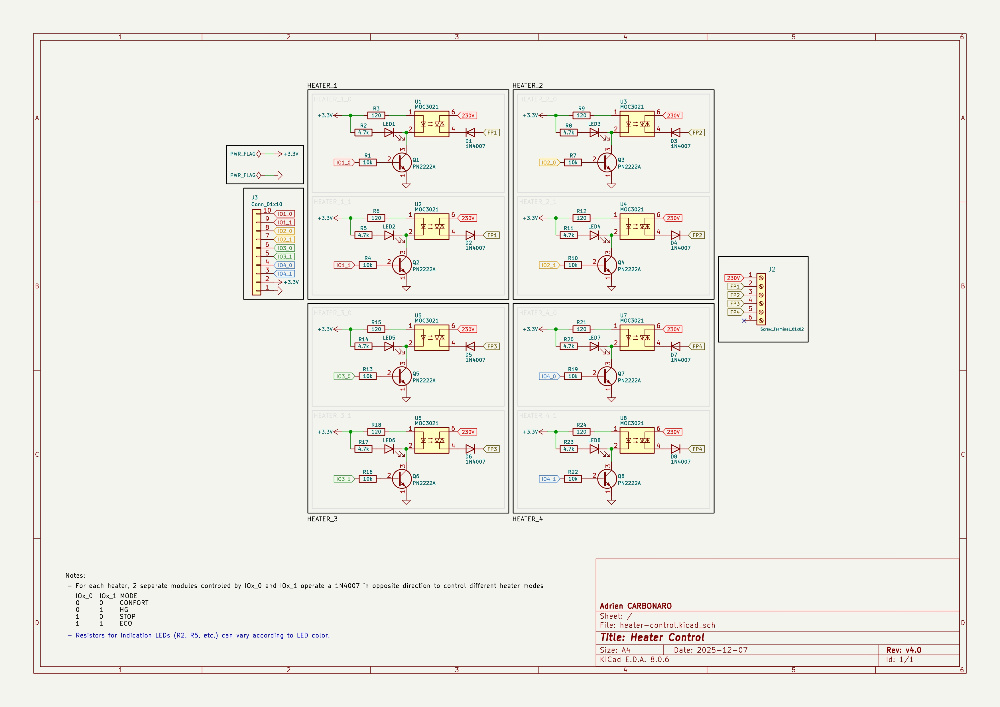
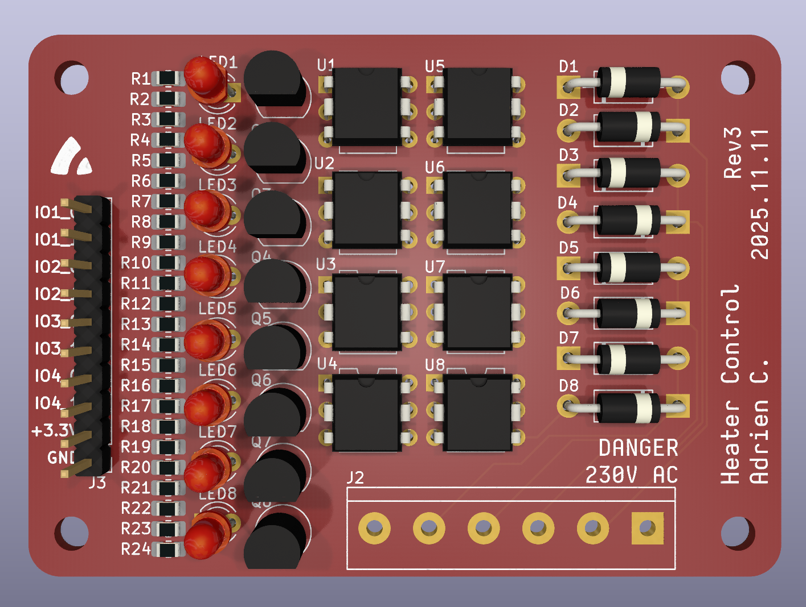

# Controller for "Fil Pilote" heater with Home Assistant - ESP32-C3


A compact Wi-Fi-enabled controller for French *fil pilote* electric
radiators, built around an ESP32-C3 module.

The system uses optotriacs and simple transistor drivers to generate the
four standard *fil pilote* modes, and communicates via MQTT for seamless
integration with Home Assistant.

# 1. Features

-   Controls **4 radiators**, each supporting the 4 official *fil
    pilote* modes:
    -   Confort (no signal)
    -   Eco (negative half-wave)
    -   Hors-gel / Frost protection (positive half-wave)
    -   Stop (full wave)
-   Uses **2 MOC3021 optotriacs per radiator** (8 total)
-   Uses optoisolation to ensure safe AC control
-   Uses *2N2222* transistor to limit the current steered from GPIOs
-   On-board status LEDs for each half-wave
-   MQTT-based command interface
-   Compact hardware using an ESP32-C3 module

# 2. How the Fil Pilote System Works

French electric radiators accept control commands via a dedicated wire
called the *fil pilote*.
By injecting specific AC waveforms, the radiator switches modes:

```
Confort:    No signal
Eco:        Negative half-wave
Hors-gel:   Positive half-wave
Stop:       Full-wave (both half-waves)
```


# 3. Hardware Overview

## 3.1. Components

-   1 ESP32-C3 microcontroller board
-   8 MOC3021 optotriacs
-   8 Diodes for AC steering
-   8 Status LEDs
-   8 2N2222 NPN transistors
-   Resistors:
    -   120 Ω for the MOC3021 LED drive
    -   10k Ω resistors for the 2N2222 base
    -   1k - 4.7k (depends on LED color) LED resistors for the status indicators

## 3.2. Electrical Principles

-   Each radiator needs **two MOC3021s** (one for each half-wave).
-   A correctly oriented diode allows the MOC to pass either the
    positive or negative AC half-cycle.
-   The ESP32-C3 GPIO activates a transistor, which drives the MOC LED
    (and indicator LED).
-   The radiator receives the correct waveform depending on which MOCs
    are activated.

**Safety note:**
You are working with 230 V AC. Ensure correct isolation, board spacing,
and a safe enclosure.





# 4. Firmware

## 4.1. MQTT Configuration Example

*Note:* The topics and messages can be modified through esp config (see below).

The firmware listens to four MQTT commands:

```
- `confort`
- `eco`
- `hors-gel`
- `stop`
```

Each radiator listens on:

```
<base_topic>/<id>/set

ex:

heater-control/1/set
heater-control/2/set
heater-control/3/set
heater-control/4/set
```

## 4.2. Getting Started

### 4.2.1. Ensure ESP-IDF is installed

You must have the ESP-IDF toolchain installed.
(Installation instructions will be added later.)

### 4.2.2. Activate the ESP-IDF environment

Before building the project, activate ESP-IDF.
(Steps will be documented later.)

### 4.2.3. Set the target to ESP32-C3

From the project directory:

``` bash
idf.py set-target esp32-c3
```

This generates a `sdkconfig` file.

### 4.2.4. Open the configuration menu

``` bash
idf.py menuconfig
```

Navigate to:

    Component config →
       Heater Control →

Configure:

-   Wi-Fi SSID
-   Wi-Fi password
-   GPIO assignments
-   MQTT server settings

Save and exit.

### 4.2.5 Build and flash

``` bash
idf.py build flash monitor
```

### 4.2.5 Build and flash

# 5. Home Assistant

## 5.1. Helper

Create an *input select* helper called `input_select.heater_control`, with 4 options (`CONFORT`, `ECO`, `H-GEL`, `STOP`).

## 5.2. Automation

Create an automation that triggers the MQTT messages:
```yaml
alias: MQTT Heater Control
description: "MQTT messages sent when changing heater mode"
triggers:
  - entity_id:
      - input_select.heater_control
    trigger: state
actions:
  - choose:
      - conditions:
          - condition: state
            entity_id: input_select.heater_control
            state: CONFORT
        sequence:
          - action: mqtt.publish
            metadata: {}
            data:
              topic: heater-control
              payload: confort
      - conditions:
          - condition: state
            entity_id: input_select.heater_control
            state: ECO
        sequence:
          - action: mqtt.publish
            metadata: {}
            data:
              topic: heater-control
              payload: eco
      - conditions:
          - condition: state
            entity_id: input_select.heater_control
            state: H-GEL
        sequence:
          - action: mqtt.publish
            metadata: {}
            data:
              topic: heater-control
              payload: hgel
      - conditions:
          - condition: state
            entity_id: input_select.heater_control
            state: STOP
        sequence:
          - action: mqtt.publish
            metadata: {}
            data:
              topic: heater-control
              payload: stop
```

*notes:*

- The `state` must match the options set in the helper.
- The `payload` key is the mqtt message being sent. It can be whatever you want, but make sure the firmware uses the same.

## 5.3. Dashboard card

Create a card that will display 4 buttons, which will trigger the input select change, which will trigger the automation.


Notes:
- This example uses `custom:button-card` which must be downloaded first. If you want a simpler option, you can create a simple dropdown.

```yaml
type: horizontal-stack
cards:
  - type: custom:button-card
    entity: input_select.heater_control
    name: CONFORT
    icon: mdi:radiator
    color_type: icon
    styles:
      name:
        - padding-top: 5px
      card:
        - color: "#ffa758"
          background-color: "#ffa75820"
          border-color: "#ffa758"
          border-width: 2px
      icon:
        - color: "#ffa758"
    tap_action:
      action: call-service
      service: input_select.select_option
      target:
        entity_id:
          - input_select.heater_control
      data:
        option: CONFORT
    state:
      - value: CONFORT
        styles:
          card:
            - color: white
              background-color: "#ffa758"
              border-color: "#ffa758"
          icon:
            - color: white
  - type: custom:button-card
    entity: input_select.heater_control
    name: ECO
    icon: mdi:power-sleep
    color_type: icon
    styles:
      name:
        - padding-top: 5px
      card:
        - color: "#3359b0"
          background-color: "#3359b020"
          border-color: "#3359b0"
          border-width: 2px
      icon:
        - color: "#3359b0"
    tap_action:
      action: call-service
      service: input_select.select_option
      target:
        entity_id:
          - input_select.heater_control
      data:
        option: ECO
    state:
      - value: ECO
        styles:
          card:
            - color: white
              background-color: "#3359b0"
              border-color: "#3359b0"
          icon:
            - color: white
  - type: custom:button-card
    entity: input_select.heater_control
    name: H-GEL
    icon: mdi:weather-hail
    color_type: icon
    styles:
      name:
        - padding-top: 5px
      card:
        - color: "#78d0de"
          background-color: "#78d0de20"
          border-color: "#78d0de"
          border-width: 2px
      icon:
        - color: "#78d0de"
    tap_action:
      action: call-service
      service: input_select.select_option
      target:
        entity_id:
          - input_select.heater_control
      data:
        option: H-GEL
    state:
      - value: H-GEL
        styles:
          card:
            - color: white
              background-color: "#78d0de"
              border-color: "#78d0de"
          icon:
            - color: white
  - type: custom:button-card
    entity: input_select.heater_control
    name: STOP
    icon: mdi:radiator-disabled
    color_type: icon
    styles:
      name:
        - padding-top: 5px
      card:
        - color: "#818b94"
          background-color: "#818b9420"
          border-color: "#818b94"
          border-width: 2px
      icon:
        - color: "#818b94"
    tap_action:
      action: call-service
      service: input_select.select_option
      target:
        entity_id:
          - input_select.heater_control
      data:
        option: STOP
    state:
      - value: STOP
        styles:
          card:
            - color: white
              background-color: "#818b94"
              border-color: "#818b94"
          icon:
            - color: white
```